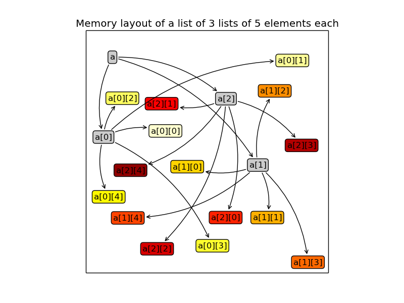

The array model
---------------

In terms of memory bandwidth, localized data is better than scattered data.

The NumPy array (``ndarray``) is defined by 4 attributes:

  :dtype: The common type of the array's data. It can be a basic type, such as integers, floats or strings of fixed length. NumPy provides many more basic types than Python does (``int8``, ``int16``, ``int32``, ``float16``, ``float32`` etc.). We will see that these basic dtype can be combined to create structured dtype, which are similar to records (or C struct). An extension provides quaternions as dtype.

          .. warning:: The name ``float128`` is misleading. This data type is unlikely to represent quadruple precision (but C type ``long double`` instead). Try:

                    >>> [np.finfo(_).eps for _ in (np.float16, np.float32, np.float64, np.float128)]
                    >>> [0.00097656, 1.1920929e-07, 2.2204460492503131e-16, 1.084202172485504434e-19]

  :shape: A tuple containing the array dimensions (the length of the array axes, in NumPy terminology).

          .. note::
             * a dimension of zero is valid
             * the shape ``()`` is valid, it corresponds to a 0-ranked array, similar to a scalar.

  :strides: A tuple containing how many bytes should be walked in the memory to go from one element to the next one along each dimension.
            
            >>> np.zeros((3, 5)).strides
            (40, 8)

            .. note:: The fast dimension is that with the smallest stride. By default, when an array is created, it is the last one (row-major storage order like C and unlike Fortran, Matlab and IDL), but note that this is not the case for every array:

                      >>> np.zeros((3, 5)).T.strides
                      (8, 40)

                      When iterating through a multi-dimensional array (check beforehand that you really have to...), make sure that you are indexing first the actual slow dimension(s) in the ``for`` loop(s).

  :ctypes.data: The memory location of the first array element (but you should not worry about it)

An array also has convenience attributes, which can be derived from the previous ones:

  :ndim: number of dimensions (or array's rank, in NumPy wavering terminology)
  :size: number of elements
  :itemsize: number of bytes of one element
  :nbytes: number of bytes of all elements

.. note:: The ``len`` function can be confusing when applied on arrays: it returns the number of elements along the first dimension only. It is better not to use it with arrays, and use ``.shape[0]`` instead for clarity.

.. warning:: In Python (so it is also true for NumPy arrays), the assignation operator '=' does not make a copy. It adds a reference to the reference list of an object stored in memory. When the number of references drops to zero, the object will disappear and for arrays the memory buffer will be released.

    >>> a = np.arange(100)
    >>> b = a
    >>> id(a) == id(b)
    True

    So, to ensure that the arrays are different, you should explicitly make a copy:

    >>> b = a.copy()

    In the same vein, here is the wrong way to assign 2 to an array:

    >>> a = np.arange(100)
    >>> type(a)
    numpy.ndarray
    >>> a = 2
    >>> type(a)
    int

    The proper way to do it is:

    >>> a = np.arange(100)
    >>> a[...] = 2
    >>> type(a)
    numpy.ndarray

Creating arrays
---------------

* There are plenty of ways to create an array. The simplest one is to convert a Python list or tuple:

  >>> np.array([1, 2, 3.14, 4])
  array([ 1.  ,  2.  ,  3.14,  4.  ])

  The data type of the resulting array is inferred from the types of the elements in the sequence, but it can be explicitly set with the ``dtype`` keyword:

  >>> np.array([1, 2, 3.14, 4], dtype=np.int8)
  array([1, 2, 3, 4], dtype=int8)
  >>> np.array([1, 2, 3.14, 4], dtype=complex)
  array([ 1.00+0.j,  2.00+0.j,  3.14+0.j,  4.00+0.j])

  Multi-dimensional arrays can be created using the same mechanism by nesting sequences, the innermost ones corresponding to the last dimension. Here is an example of a 2-by-3 array:

  >>> a = np.array([[1, 2, 3], [1, 0, 1]])
  array([[1, 2, 3],
         [1, 0, 1]])
  >>> a.shape
  (2, 3)
  >>> a[0, :]
  array([1, 2, 3])
  >>> a[1, :]
  array([1, 0, 1])

  Although it is cumbersome (we will see better ways to achieve that), a 4-by-1 array (a column) can be similarly created:

  >>> np.array([[4], [-1], [2], [0]])
  array([[ 4],
         [-1],
         [ 2],
         [ 0]])

* Alternatively, when the array dimensions are known, the array can be allocated in memory and optionally filled with a particular value. The array may then be updated at a later stage.

  :zeros: allocate a 0-filled array of given shape

         >>> np.zeros((2, 2))
         array([[ 0.,  0.],
                [ 0.,  0.]])

  :ones: allocate a 1-filled array of given shape

         >>> np.ones((2, 2))
         array([[ 1.,  1.],
                [ 1.,  1.]])

  :full: allocate an array of given shape filled by a given value (Numpy 1.8)

         >>> np.full((2, 2), np.pi)
         array([[ 3.14159265,  3.14159265],
                [ 3.14159265,  3.14159265]])

  :empty: allocate an array of given shape without initializing its values

          .. note:: This function is much faster, but be careful to completely populate the array afterwards.

.. note:: By default, these functions return a ``float64`` array. To specify another data type, use the ``dtype`` keyword.

* It is possible to use another variable as a template to create a new array with the same data type and shape:

  >>> a = np.array([[1, 2, 3], [3, 2, 1]])
  >>> b = np.zeros_like(a)
  >>> c = np.ones_like(a)
  >>> d = np.full_like(a, 2.)
  >>> e = np.empty_like(a)
  >>> for _ in a, b, c, d, e:
  ...     print(_.dtype, _.shape)
  (dtype('int64'), (2, 3))
  (dtype('int64'), (2, 3))
  (dtype('int64'), (2, 3))
  (dtype('int64'), (2, 3))
  (dtype('int64'), (2, 3))

* Since discretization is at the heart of scientific computing, the creation of grids has been made straightforward and it can be done in several ways:

  :arange: Return evenly spaced values (the number of elements is known).

           >>> np.arange(10, dtype=float)
           array([ 0.,  1.,  2.,  3.,  4.,  5.,  6.,  7.,  8.,  9.])
           >>> start = 1
           >>> step = 0.1
           >>> n = 10
           >>> start + np.arange(n).reshape(2, -1) * step
           array([[ 1. ,  1.1,  1.2,  1.3,  1.4],
                  [ 1.5,  1.6,  1.7,  1.8,  1.9]])

           .. note:: other calling sequences than ``start + np.arange(n) * step`` can be used with ``arange``, but there are little compelling reasons to use them (see next function ``linspace``).

  :linspace: Return evenly spaced values (the boundaries are known).

             >>> np.linspace(2, 4, 6)
             array([ 2. ,  2.4,  2.8,  3.2,  3.6,  4. ])

  :logspace: Return numbers spaced evenly on a log scale. By default the base 10 is used. The end points specify the base's powers.

             >>> np.logspace(0, 2, 5)
             array([ 1., 3.16227766, 10., 31.6227766, 100.])

             .. note:: unlike Python's ``range`` builtin, the last point of the interval is included by default in the array returned by ``linspace`` and ``logspace``.

  :meshgrid: Return coordinate matrices from two or more coordinate vectors.

             >>> nx, ny = (3, 2)
             >>> x_1d = np.linspace(0, 1, nx)
             >>> y_1d = np.linspace(0, 1, ny)
             >>> x_2d, yv_2d = np.meshgrid(x_1d, y_1d)
             >>> x_2d
             array([[ 0. ,  0.5,  1. ],
                    [ 0. ,  0.5,  1. ]])
             >>> y_2d
             array([[ 0.,  0.,  0.],
                    [ 1.,  1.,  1.]])
             >>> np.sqrt(x_2d**2 + y_2d**2)
             array([[ 0.        ,  0.5       ,  1.        ],
                    [ 1.        ,  1.11803399,  1.41421356]])

* Creation of arrays populated by pseudonumbers. The package ``numpy.random`` contains pseudonumber generators for the usual distributions. Many more are available in ``scipy.stats``.

  :random_itegers: Return random integers between a lower and upper value, inclusive.

    .. note:: ``randint`` also exists. It doesn't do anything that ``random_integers`` cannot, except confusing the user. Stick with ``random_integers``, which has a better name.

    .. note:: Even if a default value exists for the lower value, it is better practice to specify both the lower and upper values (``randint`` has not the same default value, so don't bother memorizing it).

    >>> np.random.random_integers(1, 6, (3, 2))
    array([[5, 2],
           [3, 6],
           [1, 6]])

  :random_sample: Return uniformly distributed random floats in the half-open interval [0.0, 1.0).

    .. note:: for the only purpose of confusing users even more, this function has 3 aliases ``random``, ``randf`` and ``sample``! Avoid them. And there's also ``rand``, see note below.

    >>> np.random.random_sample((3, 2))
    array([[ 0.55442892,  0.97919858],
           [ 0.40742057,  0.00879652],
           [ 0.098388836,  0.67112335]])

  :standard_nomal: Return random floats from the standard normal distribution.

    >>> np.random.standard_normal((3, 2))
    array([[ 1.72573865,  0.8938781 ],
           [ 0.37971588, -0.40010123],
           [-0.33761754,  0.07175398]])

  .. note:: I prefer not to use MATLAB® equivalent shortcuts ``rand`` and ``randn`` for ``random_sample`` and ``standard_normal``, even if they are available in ``numpy``'s module namespace, since their calling sequence ``rand(d0, d1, ...)`` is inconsistent with that of NumPy functions such as ``zeros``, ``ones``, ``random_integers``, ``random_sample``, ``standard_normal``, ``standard_cauchy`` etc., which use a tuple to specify the array shape.

Basic operations
----------------

* Functions in NumPy are vectorized

  :np.sum: sum of elements
  :np.product: product of elements
  :np.cumsum: cumulative sum of elements
  :np.cumproduct: cumulative product of elements
  :np.sort: sort elements
  :np.argsort: return the indices that would sort an array
  :np.all: return True if all array elements evaluate to True
  :np.any: return True if any array element evaluates to True
  :np.min: return the minimum element of an array
  :np.max: return the maximum element of an array

  .. note:: Python builtin functions ``all``, ``any``, ``min`` and ``max`` should not be used with NumPy arrays since 1) they are slow and 2) they will not work on multi-dimensional arrays.

  With these functions, an axis can be specified: it is the axis that will be collapsed and along which the operation is performed.

  >>> a = arange(8).reshape((2, 4))
  >>> print(a)
  [[0 1 2 3]
   [4 5 6 7]]
  >>> print(np.sum(a, axis=0))
  [ 4  6  8 10]
  >>> print(np.sum(a, axis=1))
  [ 6 22]

  .. note:: axes can be specified by starting from the last one, using negative values. ``-1`` stands for the last axis, ``-2`` for the last but one.

* Most common operations with two operands are performed element-wise:

  >>> a = np.array([[0, 1, 0],
  ...               [2, 3, 4]])
  >>> b = np.array([[2, 2, 2],
  ...               [3, 3, 3]])
  >>> a * b
  array([[ 0,  2,  0],
         [ 6,  9, 12]])

* Boolean operations.
  
  The operators ``not``, ``and`` and ``or`` should not be used with arrays.

  === = ========================
  not → ``~`` or ``logical_not``
  and → ``&`` or ``logical_and``
  or  → ``|`` or ``logical_or``
  xor → ``^`` or ``logical_xor``
  === = ========================

  .. note:: The operators ``~``, ``&``, ``|`` and ``^`` have a very high priority, so parenthesis must be used to combine expressions. The following example shows how to print the number of times that 1 or 10 are drawn from a uniform distribution:

    >>> a = np.random.random_integers(1, 10, 1000)
    >>> np.sum((a == 1) | (a == 10))
    207

.. topic:: **Exercise**: Computation of :math:`\pi` by Monte-Carlo sampling.
    :class: green

    Given the random variables X and Y following the uniform distribution between -1 and 1, the probability for the point (X, Y) to be inside the unity disk is the ratio of the surface of the unity disk and that of the unity square, i.e. :math:`\pi/4`. It is then possible possible to compute :math:`\pi` by drawing realizations of X and Y and counting the fraction of points (X, Y) inside the unity disk.

    Vectorize the following pure Python code, by using NumPy arrays and functions.

    .. literalinclude:: pi_montecarlo_slow.py
        :lines: 5-

    .. only:: html

        [:ref:`Solution <pi_montecarlo.py>`]

Indexing arrays
---------------

* integers and slices: like Python

  .. warning:: indexing starts at 0!

  .. warning:: in slices, the stop point is excluded from the selection!

  .. note:: negative indices are fine.

  >>> a = np.arange(10)
  >>> a[3: -3]
  array([3, 4, 5, 6])
  >>> a[::2]
  array([0, 2, 4, 6, 8])
  >>> a.strides, a[::2].strides
  (8,), (16,)

* The ellipsis ``...`` replaces as many ``:`` as possible. For an array ``a`` of rank 4: ``a[..., 0, :]`` is equivalent to ``a[:, :, 0, :]``

  >>> a = np.arange((2, 3, 4, 5))
  >>> a[..., 0].shape
  (2, 3, 4)

  .. note:: ``a[i]`` is equivalent to ``a[i, ...]``

* A boolean array can be used as a mask to select elements.

  >>> x = np.random.random_sample(1000)
  >>> x[x > 3] = 0

  .. note:: Use boolean masks instead of the ``where`` function!

* selection indexing: an integer array can also be used

  >>> x = np.random.random_sample(1000)
  >>> index = np.argsort(x)
  >>> x[index[:10]] = 0

.. topic:: **Exercise**: Histogram
  :class: green

  Complete the missing parts of the code below to do this exercise.
  Given a large number of particules of velocities :math:`v_x, v_y, v_z` distributed according to the standard normal distribution, plot the histogram of the speed in 1, 2 and 3 dimensions:

      .. math::
        v_1 &= |v_x| = \sqrt{v_x^2} \\
        v_2 &= \sqrt{v_x^2+v_y^2} \\
        v_3 &= \sqrt{v_x^2+v_y^2+v_z^2}

  and compare it to the theoretical Maxwell distributions:

      .. math::
         f_n(v) = \left(\frac{\pi}{2}\right)^{-\frac{|n-2|}{2}} v^{n-1} e^{-\frac{1}{2}v^2}

  where :math:`n` = 1, 2, 3 is the number of dimensions.

  ::

    from __future__ import division
    import numpy as np
    from matplotlib import pyplot as mp

    def velocity2speed(velocity, ndims):
        """ Return the ndims-dimensional speed of the particles. """
        return ...

    def speed_distribution(speed, ndims):
        """
        Return the probability distribution function of the ndims-dimensional
        speed of the particles.
        """
        return ...

    NPARTICULES = 1000000

    velocity = np.random.standard_normal((NPARTICULES, 3))

    for ndims in (1, 2, 3):
        speed = velocity2speed(...)
        ax = mp.subplot(1, 3, ndims)
        n, bins, patches = ax.hist(speed, ...)
        ax.set_title('{}-d speed distribution'.format(ndims))
        ax.set_xlim(0, 5)
        ax.set_ylim(0, 0.9)
        ax.set_xlabel('speed')
        ax.plot(..., ..., 'r', linewidth=2)

    mp.show()

  .. only:: html

            [:ref:`Solution <plot_maxwell.py>`]

Manipulating arrays
-------------------

* Transformations that change the shape but not the size

:.reshape: Give a new shape.

           .. note:: One shape dimension can be -1. In this case, the value is inferred from the number of elements of the array and the remaining dimensions.

                     >>> a = np.ones((4, 2, 7))
                     >>> b = a.reshape((4, -1))
                     >>> b.shape
                     (4, 14)

:.ravel: Flatten an array to one dimension.

         .. note:: By default, in the ``reshape`` and ``ravel`` transformations, the elements of the input and output array are identical when both travelled following the row-major order.

:.T: Transpose of the array.
:.swapaxes: Interchange two axes.
:np.rollaxis: Roll a specified axis backwards, until it lies in a given position.
:.squeeze: Remove single-dimensional entries from the shape of the array.

It is also easy to add a new dimension, using ``None`` (or equivalently ``np.newaxis``):

>>> a = np.zeros((3, 5))
>>> a[..., None].shape
(3, 5, 1)
>>> a[:, None, :].shape
(3, 1, 5)
>>> a[None, ...].shape
(1, 3, 5)

We will see later how much this notation can be handy when used in conjonction with broadcasting.

* Transformations that change the size

:np.resize: Return a new array with the specified shape, repeating the array if necessary
:tile: Construct an array by repeating A the given number of times.
:resize: TBD
:repeat: TBD

.. topic:: **Exercise**:
    :class: green

    Write a function that returns the mean of each 100 element block of a vector of size 100×N. The first version will loop over the vector slices by using a list comprehension and the second one will use NumPy transformation functions to avoid the ``for`` loop. The vector elements will be drawn from any statistical distribution. 

    .. only:: html

        [:ref:`Solution <block_mean.py>`]

Views and copies
----------------

A powerful aspect of NumPy's array model is that many operations can be performed without copying the data, which can be expensive especially when handling big datasets. For instance, indexing using a slice returns a view on the initial array, which mean that the initial and sliced arrays share the same memory buffer. This is a frequent source a confusion, since modifying the view will affect the original array. It is then important to know which operations return a view and which ones a copy. A view on an array is different from a reference: even though they share the same memory buffer, the viewing and viewed arrays are different Python objects:

    >>> a = np.zeros(10)
    >>> b = a.view()
    >>> id(a) == id(b)
    False
    >>> a.ctypes.data == b.ctypes.data
    True

.. topic:: **Exercise**:
       :class: green

       Given the function

       >>> def isview(a, b):
       ...     """
       ...     Return True if b is a view on a.
       ...     (It is assumed that a's memory buffer is contiguous)
       ...     """
       ...     return a.ctypes.data <= b.ctypes.data < a.ctypes.data + a.nbytes

       and the array

       >>> a = np.arange(24, dtype=float)
       >>> a.shape = (3, 2, 4)

       let's first check that slicing an array does not copy it:

       >>> isview(a, a[:2, 1, 1:3])
       True

       Then, check what the following actions do and whether their result is a view or a copy:

       ::

           a.copy()
           a[:, ::-1, :]
           a.view(complex)
           a.view([('position', float, 3), ('mass', float)])
           a.reshape((6, -1))
           a[..., None]
           a.ravel()
           a.flatten()
           a.T
           a.T.ravel()
           a.swapaxes(0, 1)
           np.rollaxis(a, 2)
           a.astype(int)
           a.astype(float)
           np.asarray(a)
           np.asarray(a, dtype=float)
           np.asarray(a, dtype=int)
           np.array(a, dtype=float, copy=False)

Combining arrays
----------------

  :r\_: Translate slice objects to concatenation along the first axis.

        >>> np.r_[np.array([1,2,3]), 0, 0, np.array([4,5,6])]
        array([1, 2, 3, 0, 0, 4, 5, 6])
  :hstack: Stack arrays in sequence horizontally (column wise).
  :vstack: Stack arrays in sequence vertically (row wise).
  :dstack: Stack arrays in sequence depth wise (along third axis).
  :concatenate: Join a sequence of arrays together.
  :column_stack: Stack 1-D arrays as columns into a 2-D array.
  :row_stack: Stack arrays in sequence vertically (row wise).

Broadcasting
------------

Broadcasting allows operations (such as addition, multiplication etc.) which are normally elementwise to be carried on arrays of different shapes. It is a virtual replication of the arrays along the missing dimensions. It can be seen as a generalization of operations involving an array and a scalar.

* the addition of a scalar on an matrix can be seen as the addition of a matrix with identical elements (and same dimensions).

* the addition of a row on a matrix will be seen as the addition of a matrix with replicated rows (the number of columns must match).

* conversely the addition of a column on a matrix will be seen as the addition of a matrix with replicated columns (the number of rows must match)

.. image:: broadcast_column.png

* What if the arrays (still of same rank) have a rank greater than 2? There is no restriction on the rank: any dimension of length 1 of an array is virtually replicated to match the other array dimension length. Both arrays may have dimensions that will be broadcast. If this happens, the result of the operation will have more elements than any of the operands.

* Can it work on arrays of different ranks? Sure! Dimensions of length 1 are **prepended** (added on the left of the array shape) until the two arrays have the same rank. As a consequence, the following operation is possible:

    >>> np.zeros((5, 9)) + np.ones(9)

  but not this one, since the righmost dimensions are different:

    >>> np.zeros((5, 9)) + np.ones(5)
    ValueError: operands could not be broadcast together with shapes (5,9) (5)

  So for columns, an additional dimension must be specified and added on the right:

    >>> np.zeros((5, 9)) + np.ones(5)[:, None]

* Can it work on more than two arrays? Yes again! But you have to find an elementwise operation with more than two operands...

* Since the replication is virtual, no memory is wasted. Broadcasting is fast. Use it wherever possible, just keep an eye on the size of the broadcast result to make sure that it does not become too large.

.. topic:: **Exercise**:
    :class: green

    Can the arrays of the following shapes be broadcast together? If yes, what would be the shape of the result?

    * (7, 1) and (7, 4)

    * (7,) and (4, 7)

    * (3, 3) and (2, 3)

    * (1, 1, 1, 8) and (1, 9, 1)

    * (4, 1, 9) and (3, 1)

    .. only:: html

        [:ref:`Solution <broadcasting_shapes>`]

.. topic:: **Exercise**:
    :class: green

    Remove the ``for`` loops in this code by using broadcasting and measure the improvement in execution time.

    ::

      from __future__ import division
      import numpy as np

      NDETECTORS = 8
      NSAMPLES = 1000
      SAMPLING_PERIOD = 0.1
      GLITCH_TAU = 0.3
      GLITCH_AMPL = 20
      GAIN_SIGMA = 0.03
      SOURCE_AMPL = 7
      SOURCE_PERIOD = 5
      NOISE_SIGMA = 0.7

      time = np.arange(NSAMPLES) * SAMPLING_PERIOD
      glitch = np.zeros(NSAMPLES)
      glitch[100:] = GLITCH_AMPL * np.exp(-time[:-100] / GLITCH_TAU)
      gain = 1 + GAIN_SIGMA * np.random.standard_normal(NDETECTORS)
      offset = np.arange(NDETECTORS)
      source = SOURCE_AMPL * np.sin(2 * np.pi * time / SOURCE_PERIOD)
      noise = NOISE_SIGMA * np.random.standard_normal((NDETECTORS, NSAMPLES))
      
      signal = np.empty((NDETECTORS, NSAMPLES))
      for idet in xrange(NDETECTORS):
          for isample in xrange(NSAMPLES):
              signal[idet, isample] = gain[idet] * source[isample] + \
                                      glitch[isample] + offset[idet] + \
                                      noise[idet, isample]

      mp.figure()
      mp.subplot('211')
      mp.imshow(signal, aspect='auto', interpolation='none')
      mp.xlabel('sample')
      mp.ylabel('detector')
      mp.subplot('212')
      for s in signal:
          mp.plot(time, s)
      mp.xlabel('time [s]')
      mp.ylabel('signal')
      mp.show()

    .. only:: html

        [:ref:`Solution <plot_broadcasting.py>`]

.. topic:: **Exercise**:
    :class: green

    Write a one-liner function that normalizes by the euclidian norm M N-dimensional real vectors packed in an array of shape (M, N).

    .. only:: html

        [:ref:`Solution <normalize.py>`]

Universal functions (Ufuncs)
----------------------------

TBD

>>> tf = np.array([True, False])
>>> np.logical_and.outer(tf, tf)
array([[ True, False],
       [False, False]], dtype=bool)
>>> np.logical_or.outer(tf, tf)
array([[ True,  True],
       [ True, False]], dtype=bool)

Special values
--------------

NumPy supports IEEE 754 floating point special values `NaN` and `inf`. These literal values are available as ``np.nan`` and ``np.inf`` and are stored as Python ``float``.

NumPy's behaviour when an IEEE exception occurs is configurable with the ``seterr`` function. If your code produce NaNs, you can raise exceptions when NaN are triggered to know where the problem happens:

    >>> np.seterr(invalid='raise')

To inspect these special values:

:isinf: Return True for positive or negative infinite numbers
:isnan: Return True for NaN elements

    >>> from __future__ import division
    >>> N = 1000000
    >>> a = np.random.random_integers(0, 10, N)
    >>> b = np.random.random_integers(0, 10, N)
    >>> c = a / b
    >>> np.all(np.isnan(c) == ((a == 0) & (b == 0)))
:isfinite: Return True for infinite or NaN elements

And to make them non-special:

:nan_to_num: Set `NaN` to zero, `+inf` to max float and `-inf` to min float

When NaN values are present in an array, most NumPy functions will propagate them to the result instead of restricting the operation to the non-NaN elements. To explicitly discard the NaNs, one should call the following functions: ``nanmin``, ``nanmax``, ``nanargmin``, ``nanargmax``, ``nanmean``, ``nanstd``, ``nanvar``, ``nansum``.

Structured data types
---------------------

Basic data types can be combined to form structured data types, akin to C's ``struct`` or Fortran's derived types. The synthax to create such records is strict, it must be a **list** of **tuples**, each tuple containing the name, data type and optionally the shape of the field. The field values are accessed by using brackets.

>>> point_dtype = [('x', float), ('y', float), ('z', float)]
>>> n = 100
>>> points = np.empty(n, dtype=point_dtype)
>>> points['x'] = np.random.random_sample(n)
>>> points['y'] = np.random.random_sample(n)
>>> points['z'] = np.random.random_sample(n)
>>> points[0]
(0.1620762355727834, 0.2395019980532217, 0.9167745701692562)
>>> points[10] = (1, 1 , 0)

Another example, in which the shapes of the fields are specified:

>>> spectra_dtype = [('fluxdensity', float, 100),
...                  ('wavelength', float, 100)]
>>> spectrum = np.zeros((), dtype=spectra_dtype)
>>> spectrum['wavelength'].size
100

.. note:: Fields can be strings, but since array elements must have a fixed common ``itemsize``, it is mandatory to specify the maximum number of characters. Structured data types can also be combined together:

   >>> galaxy_dtype = [('name', 'S256'),
   ...                 ('pos', point_dtype)]
   >>> galaxy = np.zeros(10, dtype=galaxy_dtype)
   >>> galaxy[0] = ('M81', (1, -1, 0))
   >>> galaxy[0]['name']
   'M81'
   >>> galaxy[0]['pos']['x'], galaxy[0]['pos']['y'], galaxy[0]['pos']['z']
   (1.0, -1.0, 0.0)

.. topic:: **Exercise**: Indirect sort.
    :class: green

    An indirect sort consists in using an array to sort another one.

    First, create a structured dtype with a string field ``name`` (no more than 10 characters) and an integer field ``age``. Then use it to allocate a large array of people. The ``name`` field will be populated with ``id1``, ``id2``, etc. and the ``age`` field according to any random distribution. Sort the people according to their age by two methods: 1) using the function ``argsort`` and 2) looking at the ``sort`` documentation related to structured arrays.

    .. only:: html

        [:ref:`Solution <indirect_sort.py>`]

Record arrays
-------------

Accessing fields in structured arrays by using brackets can be a bit clumsy. Fortunately, it is possible to access these fields in a more concise way, as attributes, by using record arrays. It can be done in the following way (field values are not initialized):

    >>> source = np.recarray(10, dtype=[('name', 'S256'),
    ...                                 ('ra', float),
    ...                                 ('dec', float)])
    >>> source[0] = ('M81', 148.8882208, 69.0652947)
    >>> print(source[0].name, source[0].ra, source[0].dec)
    ('M81', 148.8882208, 69.065294699999995)

.. warning:: An existing structured array can be viewed as a ``recarray``:

    >>> source = np.empty(10, dtype=source_dtype).view(np.recarray)
    >>> source[0] = ('M81', (1, -1, 0))

    But attribute access is broken for scalars (NumPy 1.8):

    >>> source[0].name
    AttributeError: 'numpy.void' object has no attribute 'name'

    So one should write:

    >>> source.name[0]
    'M81'

    For record arrays obtained with ``np.recarray``, attribute access is also broken (NumPy 1.8) for scalars with nested data types (write ``galaxy.pos.x[0]`` instead of ``galaxy[0].pos.x`` as well).
